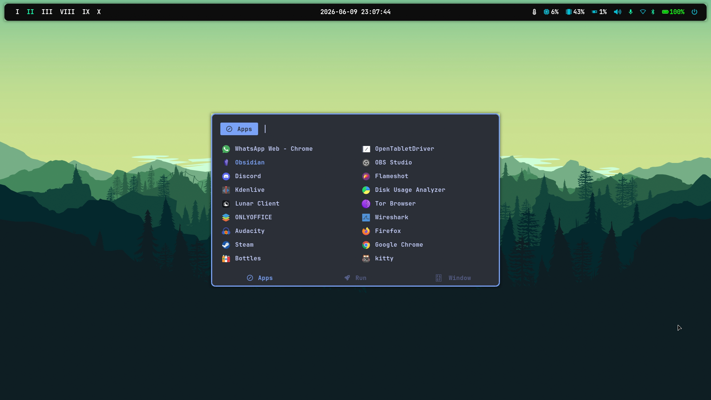
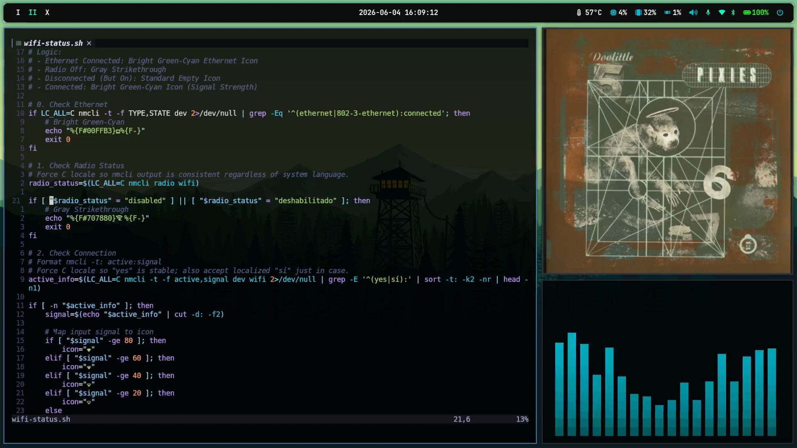
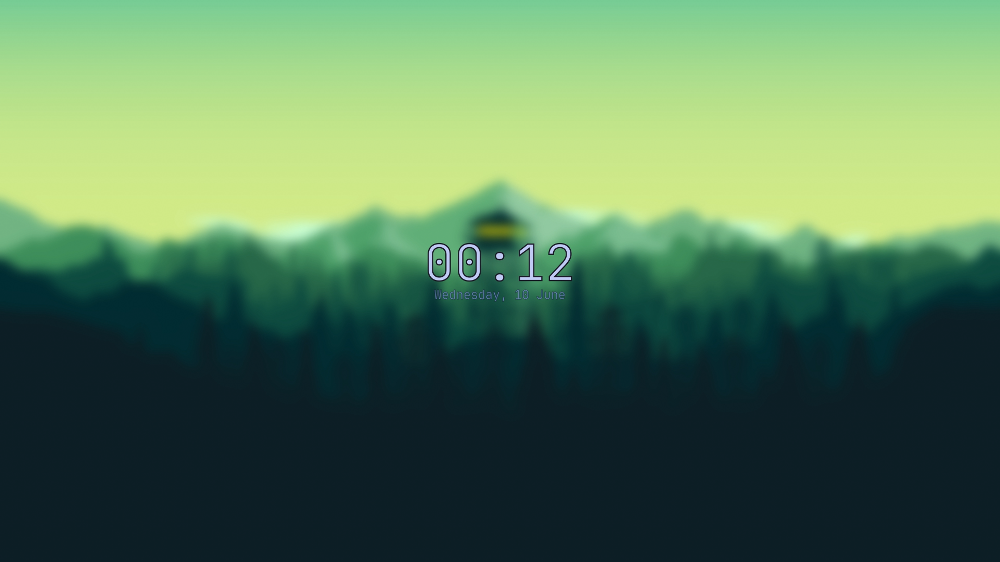
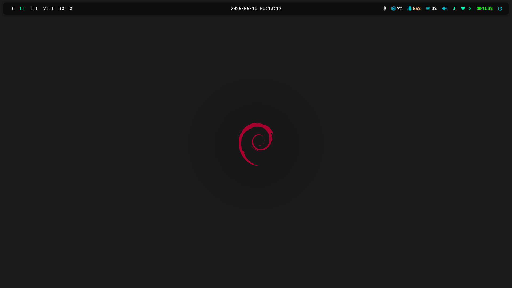

# SygurDot

🌍 Idiomas: [English](README.en.md) | [Español](README.md)


Una configuración casual y optimizada de BSPWM para Debian. Diseñada para instalaciones limpias: Solo tenei que ejecutar el `install.sh` y disfrutar (en teoría).

## Instalación

### 1. Clonar el repositorio
```bash
git clone https://github.com/sygurd24/SygurDot.git ~/dotfiles
```

### 2. Ejecutar el instalador
```bash
cd ~/dotfiles
chmod +x install.sh
./install.sh
```

## Aviso

No soy un Profesional en esta vaina. De hecho, este es mi primer "raiceo" en Linux. Hice el 95% del código y la configuración con la ayuda de Inteligencia Artificial. Hablando en términos creativos, soy el creador al 100% de la estética y la estructura, pero obviamente, esta configuración no sería posible sin la IA haciendo el trabajo pesado. Literalmente he usado Windows toda mi vida y un día me dio en cambiarme a Linux... pero como se debe, personalizando todo mi entorno desde cero, y honestamente no podría estar más complacido con el resultado. Toda esta vaina incluso me animo a crear un canal en youtube... quien sabe cuanto dure.

Si encuentras algún bug, ¡por favor házmelo saber! Estoy completamente abierto a futuros commits, PRs, issues y a colaborar aquí en GitHub.

## ¿Por qué BSPWM?

Básicamente, porque fue el primer gestor de ventanas que descubrí. Lo combiné con `sxhkd` para manejar todos los atajos de teclado, y `picom` para los efectos visuales. También lo elegí porque es uno de los gestores de ventanas más famosos que hay y quería algo muy estable sobre lo cual construir.

## Requisitos

Este entorno está muy enfocado en usuarios que parten de un "net install" o una instalación súper básica. Simplemente ejecutando `install.sh`, el script se encargará de descargar todo lo que el entorno necesita. No tienes que preocuparte por instalar nada manualmente antes (en teoría). Solo necesitas el sistema operativo base, clonar el repositorio y ejecutar el instalador.

Otros requisitos esenciales:
- Disposición para aprender y no rendirse fácilmente (la primera semana de configuración necesitaras mucho de esto).
- Una buena taza de café (yo no tomo cafe, pero, si tu tomas, preparate unas cuantas).
- Buena música de fondo (muy importante)
- Un asistente de IA (esto es clave).

## Vista Previa


**Limpio**, sin ninguna aplicación abierta. Solo la polybar es visible.


**Rofi**, para lanzar aplicaciones - (super + space).


**Multiventanas** una vista de los mosaicos de bspwm.  


**Pantalla de Bloqueo**, diseño personalizado para cuando bloqueas tu sesión (i3lock-color).


**Otros Fondos**, vista de la variedad de fondos de pantalla incluidos.

## Componentes Principales y Explicaciones

- **Gestor de Ventanas (`bspwm`)**: El gestor de ventanas en mosaico principal que maneja tus ventanas.
- **Demonio de Atajos (`sxhkd`)**: Maneja todos los atajos de teclado eficientemente (bspwm no los maneja directamente).
- **Barra de Estado (`polybar`)**: Módulos dinámicos que muestran espacios de trabajo, hora, red, etc.
- **Terminal (`kitty`)**: Terminal acelerada por GPU junto con `zsh` + `powerlevel10k` + plugins de autocompletado y resaltado.
- **Lanzador (`rofi`)**: Configurado para respuesta instantánea y lanzamiento de aplicaciones.
- **Compositor (`picom`)**: Maneja la transparencia de las ventanas, animaciones y desenfoque (blur).
- **Gestor de Fondos de Pantalla (`feh`)**: Administra el fondo de escritorio.
- **Herramienta de Capturas (`flameshot`)**: Una potente e interactiva herramienta gráfica para tomar capturas de pantalla.

## Inspeccionar y Editar los Archivos de Configuración

Una vez instalado todo, es probable que quieras retocar el entorno para adaptarlo a tu forma de trabajar. Todo es modular y está bien comentado. ¡Aquí tienes por dónde empezar!

### `~/.config/bspwm/bspwmrc`
Este es el "cerebro" del gestor de ventanas. Contiene las aplicaciones de inicio automático (autostart), los bordes, colores y **Reglas de Ventana (Window Rules)**. 
Por ejemplo, si quieres que una aplicación específica se abra siempre en un escritorio específico o de forma "flotante", usas `bspc rule`. Mis reglas actuales se ven algo así:
```bash
bspc rule -a Gimp desktop='^8' state=floating follow=on
bspc rule -a Chromium desktop='^2' state=tiled
bspc rule -a Pavucontrol state=floating center=true
```
*Tip: Puedes saber el "nombre" o clase de una aplicación ejecutando `xprop` en la terminal y haciendo clic sobre la ventana que quieras.*

### `~/.config/sxhkd/sxhkdrc`
Este es el "músculo" del entorno. `bspwm` no maneja los atajos de teclado por sí solo; `sxhkd` lo hace.
Aquí encontrarás todas las combinaciones de teclas. Si quieres cambiar el atajo para cerrar una ventana o abrir el navegador, este es el lugar.
También maneja las teclas multimedia (volumen y brillo). Si mis scripts de volumen o brillo no funcionan con tu hardware específico, puedes cambiar fácilmente los comandos que se ejecutan bajo esas teclas aquí.

### `~/.config/polybar/config.ini` (Barra de Estado)
Si notas que los módulos de la batería o del Wi-Fi no aparecen en tu panel, se debe a que Linux le asigna nombres de hardware diferentes a cada computadora.
- **Interfaz de Red**: Encuentra la tuya ejecutando `ip a` (por ejemplo, `wlan0` o `wlp2s0`), y actualiza la variable en la configuración de Polybar.
- **Batería**: Encuentra la tuya con el comando `ls /sys/class/power_supply/` (por ejemplo, `BAT0` o `BAT1`), y actualízala de la misma forma.

## Atajos Útiles (General)

| Atajo | Acción |
|---|---|
| `Super + Space` | Abrir Lanzador (Rofi) |
| `Super + Return` | Abrir Terminal (Kitty) |
| `Super + E` | Explorador de Archivos (Thunar) |
| `Super + F` | Navegador Web (Firefox) |
| `Super + V` | Historial del Portapapeles (Greenclip) |
| `Super + Shift + S` | Captura de Pantalla Seleccionada |
| `Print` / `Super + Shift + F` | Flameshot (GUI Completa) |
| `Super + Escape` | Recargar Atajos (sxhkd) |
| `Super + Alt + R` | Reiniciar bspwm |
| `Super + BackSpace` | Bloquear Pantalla (Personalizado) |

## Menús y Atajos de Control

| Atajo | Acción |
|---|---|
| `Super + Shift + D` | Menú de Fecha y Hora |
| `Super + Shift + N` | Menú de Redes Wi-Fi |
| `Super + Shift + B` | Menú de Bluetooth |
| `Super + Shift + M` | Menú de Micrófono (Apps Activas) |
| `Super + Shift + P` | Menú de Perfil de Energía / Batería |
| `Super + Shift + BackSpace` | Menú de Apagado (Cerrar Sesión/Reiniciar/Apagar) |
| `Super + Alt + Space` | Configuración (Idioma) |
| `Alt + Space` | Reproducir/Pausar Multimedia (Navegador) |
| `Alt + {Left, Right}` | Pista Anterior / Siguiente |

## Atajos de bspwm (Navegación y Diseño)

| Atajo | Acción |
|---|---|
| `Super + Flechas / hjkl` | Cambiar Foco (Oeste, Sur, Norte, Este) |
| `Super + M` | Alternar entre Diseño de Mosaico (Tiled) y Monóculo (Monocle) |
| `Super + Alt + S` | Alternar Pantalla Completa |
| `Super + Alt + O` | Alternar Transparencia (85% / 100%) |
| `Super + Alt + Shift + Flechas` | Redimensionar Ventana (Smart Resize) |
| `Super + {1-9, 0}` | Cambiar al Escritorio |
| `Super + Shift + {1-9, 0}` | Mover Ventana al Escritorio |
| `Super + {F1-F12}` | Cambiar al Escritorio Oculto |
| `Super + Shift + {F1-F12}` | Mover Ventana al Escritorio Oculto |
| `Super + W` | Cerrar Ventana Enfocada |
| `Super + Shift + W` | Matar Ventana |

## Características Especiales (Scripts Personalizados)

- **Guardia de Privacidad Bluetooth**: Pausa automáticamente todo el audio cuando un dispositivo Bluetooth se desconecta.
- **Entrada Dinámica de Cava**: Sincroniza la entrada de Cava con la salida de audio predeterminada.
- **Sincronización Forzada de Tiempo**: Sincroniza la hora del sistema al inicio.
- **Capacidad de Respuesta Optimizada**: Mayor tasa de repetición del teclado y atajos instantáneos.


## Scripts de Utilidad
Estas herramientas se encuentran en el directorio `scripts/` y se pueden ejecutar manualmente:
- `scripts/setup_hibernate.sh`: Configurar opciones de swap e hibernación.
- `scripts/setup_lightdm.sh`: Configurar el tema y diseño de la pantalla de inicio de sesión.

## Errores
Al tratar de hacer que el `install.sh` se encargue de instalar y configurar todo de forma automática, hubo algo en específico que se me complicó mucho... los drivers de la gráfica. Sé que por lo menos para la computadora en la que yo estoy usando este entorno actualmente (HPVICTUS15) al principio me dio unos errores pero lo logré arreglar pa' esta computadora en específico... a ti quizá te dé problemas, quizá no te los dé... como sea, tengo un archivo [Registro de errores](REGISTRO_DE_ERRORES.md) donde documenté bien este error, y otros grandes errores que tuve al configurar todo esto. Ahí lo tienes en caso de necesitarlo.

Por ahora esto es todo.
