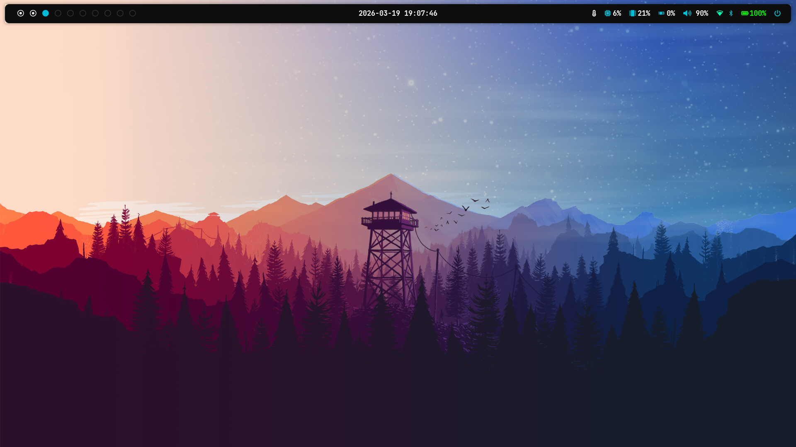

# SygurDot



A casual and optimized Bspwm setup for Debian. Designed for fresh installs: just run `install.sh` and enjoy!

## Main Components

- **Window Manager**: `bspwm` + `sxhkd` (Optimized on-press shortcuts).
- **Status Bar**: `polybar` with dynamic modules.
- **Terminal**: `kitty` + `zsh` + `powerlevel10k` + auto-suggestion and highlighting plugins.
- **Launcher**: `rofi` (configured for instant response).
- **Aesthetics**: `Arc-Dark` theme, `Papirus-Dark` icons, and `JetBrainsMono Nerd Font`.
- **Compositor**: `picom` (XRender for maximum stability).

## Special Features (Custom Scripts)

- **Bluetooth Privacy Guard**: Automatically pauses all audio when a Bluetooth device is disconnected.
- **Cava Dynamic Input**: Synchronizes Cava input with the default audio output.
- **Force Time Sync**: Synchronizes system time on startup.
- **Optimized Responsiveness**: Increased keyboard repeat rate and instant shortcuts.

## Installation

### Cloning
```bash
git clone https://github.com/sygurd24/SygurDot.git ~/dotfiles
```

### Run Installer
```bash
cd ~/dotfiles
chmod +x install.sh
./install.sh
```

### Utility Scripts
These tools are located in the `scripts/` directory and can be run manually:
- `scripts/setup_hibernate.sh`: Configure swap and hibernation settings.
- `scripts/setup_lightdm.sh`: Configure the login screen theme and layout.

## Useful Shortcuts (General)

| Shortcut | Action |
|---|---|
| `Super + Space` | Open Launcher (Rofi) |
| `Super + Return` | Open Terminal (Kitty) |
| `Super + E` | File Explorer (Thunar) |
| `Super + F` | Web Browser (Firefox) |
| `Super + V` | Clipboard History (Greenclip) |
| `Super + Shift + S` | Selected Screenshot |
| `Print` | Flameshot (Full GUI) |
| `Super + Escape` | Reload Shortcuts (sxhkd) |
| `Super + Alt + R` | Restart bspwm |
| `Super + L` | Lock Screen (Custom) |

## Menus & Control Shortcuts

| Shortcut | Action |
|---|---|
| `Super + Shift + D` | Date & Time Menu |
| `Super + Shift + N` | Wi-Fi Networks Menu |
| `Super + Shift + B` | Bluetooth Menu |
| `Super + Shift + M` | Microphone Menu (Active Apps) |
| `Super + Shift + P` | Power Profile / Battery Menu |
| `Super + Shift + BackSpace` | Power Menu (Logout/Reboot/Shutdown) |
| `Super + Alt + Space` | Configuration (Language) |
| `Alt + Space` | Play/Pause Media (Browser) |
| `Alt + {Left, Right}` | Previous / Next Track |

## bspwm Shortcuts (Navigation & Layout)

| Shortcut | Action |
|---|---|
| `Super + Arrows` | Change Focus (West, South, North, East) |
| `Super + M` | Toggle between Tiled and Monocle Layout |
| `Super + Alt + S` | Toggle Fullscreen |
| `Super + Alt + O` | Toggle Transparency (85% / 100%) |
| `Super + Alt + Shift + Arrows` | Resize Window (Smart Resize) |
| `Super + {1-9, 0}` | Switch to Desktop |
| `Super + Shift + {1-9, 0}` | Move Window to Desktop |
| `Super + W` | Close Focused Window |
| `Super + Shift + W` | Kill Window |
